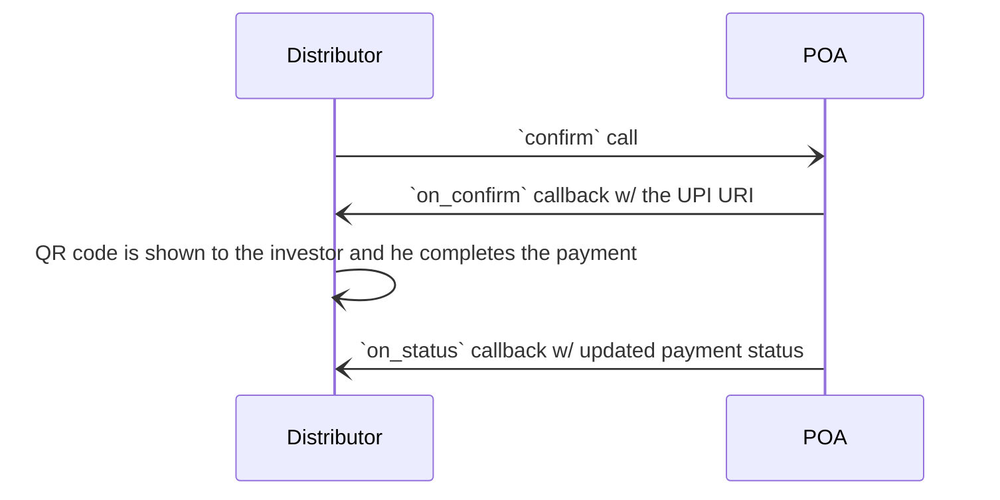
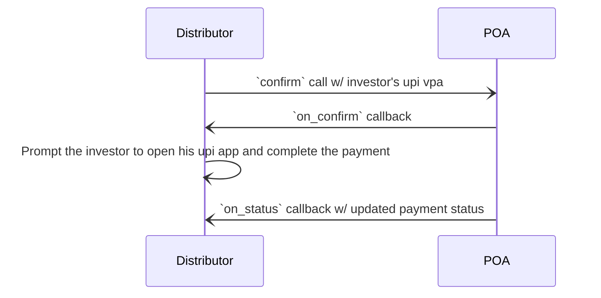

import Tabs from '@theme/Tabs';
import TabItem from '@theme/TabItem';

The following payment options related to UPI Autopay are sent in the `on_select` callback

<Tabs>
    <TabItem value="collect" label="Collect" default>
        ```json
        "payments": [
            {
                "collected_by": "BPP",
                "type": "PRE_FULFILLMENT",
                "tags": [
                    {
                        "descriptor": { "name": "Payment Method", "code": "PAYMENT_METHOD" },
                        "list": [
                            {
                                "descriptor": { "code": "MODE" },
                                "value": "UPI_AUTOPAY"
                            },
                            {
                                "descriptor": { "code": "AUTH" },
                                "value": "COLLECT"
                            },
                            {
                                "descriptor": { "code": "MANDATE_LIMIT" },
                                "value": "50000"
                            }
                        ]
                    }
                ]
            }
        ]
        ```
    </TabItem>
    <TabItem value="uri" label="URI">
        ```json
        "payments": [
            {
                "collected_by": "BPP",
                "type": "PRE_FULFILLMENT",
                "tags": [
                    {
                        "descriptor": { "name": "Payment Method", "code": "PAYMENT_METHOD" },
                        "list": [
                            {
                                "descriptor": { "code": "MODE" },
                                "value": "UPI_AUTOPAY"
                            },
                            {
                                "descriptor": { "code": "AUTH" },
                                "value": "URI"
                            },
                            {
                                "descriptor": { "code": "MANDATE_LIMIT" },
                                "value": "50000"
                            }
                        ]
                    }
                ]
            }
        ]
        ```
    </TabItem>
    <TabItem value="existing_mandate" label="Existing Mandate">
        If existing active UPI Autopay mandate is available

        ```json
        "payments": [
            {
                "collected_by": "BPP",
                "type": "PRE_FULFILLMENT",
                "tags": [
                    {
                        "descriptor": { "name": "Payment Method", "code": "PAYMENT_METHOD" },
                        "list": [
                            {
                                "descriptor": { "code": "MODE" },
                                "value": "UPI_AUTOPAY"
                            },
                            {
                                "descriptor": { "code": "AUTH" },
                                "value": "EXISTING_MANDATE"
                            },
                            {
                                "descriptor": { "code": "MANDATE_IDENTIFIER" },
                                "value": "886985"
                            },
                            {
                                "descriptor": { "code": "MASKED_BANK_ACCOUNT_NUMBER" },
                                "value": "********3111"
                            },
                            {
                                "descriptor": { "code": "BANK_ACCOUNT_NAME" },
                                "value": "Harish Gupta"
                            },
                            {
                                "descriptor": { "code": "BANK_NAME" },
                                "value": "ICICI Bank"
                            },
                            {
                                "descriptor": { "code": "MANDATE_LIMIT" },
                                "value": "50000"
                            }
                        ]
                    }
                ]
            }
        ]
        ```
    </TabItem>
</Tabs>

---

## Intent/ QR Flow

When `URI` is selected as `AUTH`, POA sends the upi uri in the payment url attribute. You can use this uri to generate a QR code in the web browser or open a upi app in the investor's mobile phone.



## Collect Flow

For collect flow, POA sends a collect request to the investor's upi vpa and waits for the investor to complete the payment. After the payment is complete, POA will send you an `on_status` callback with the update status of the payment.



## Autopay Limit

In the `on_select` callback, POA sends the default mandate limit as part of payment object's tag `PAYMENT_METHOD.MANDATE_LIMIT`. You can send a different limit by updating the tag value in the `init` call. The value must be less than `100000`.
