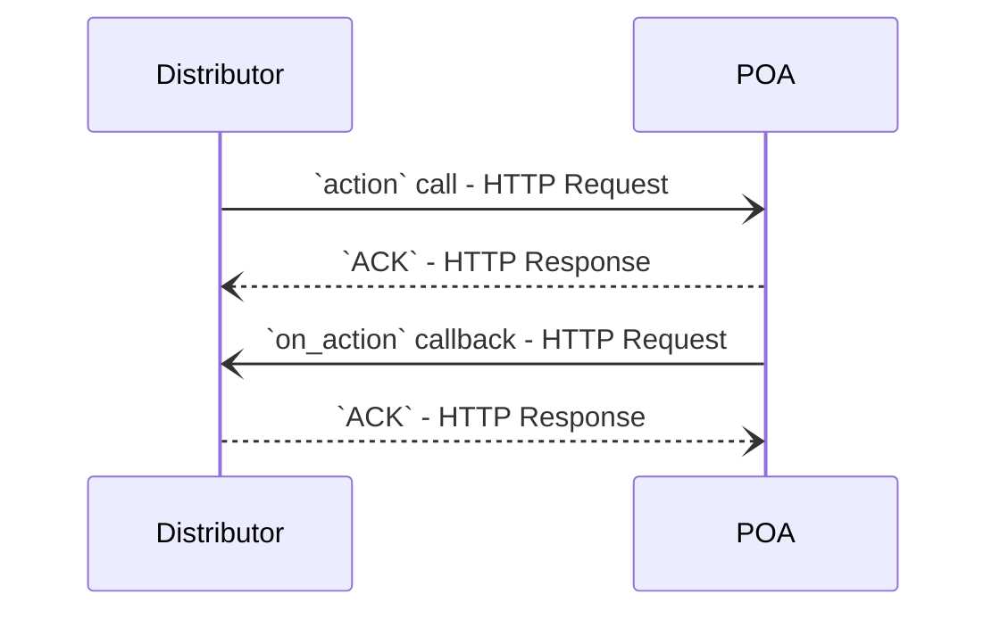

import useBaseUrl from "@docusaurus/useBaseUrl";

# Cybrilla POA

POA = Point of Acceptance

Think of POA as a digital branch, acting on behalf of the AMCs, to accept applications related to MF transactions. The applications are accepted from Mutual Fund Distributors (having ARN license or RIA license).

To submit applications, you can integrate POA APIs directly or use any of our authorized partners - [Fintech Primitives](https://fintechprimitives.com).

POA APIs use [ONDC MF Specifications](https://ondc-official.github.io/ONDC-FIS-Specifications/?branch=draft-FIS14-2.1.0). The APIs are asynchronous in nature, which means POA accepts the request (`action` call), sends an acknowledgement (`ACK`) and later respond back with the result of the request (`on_action` callback).

